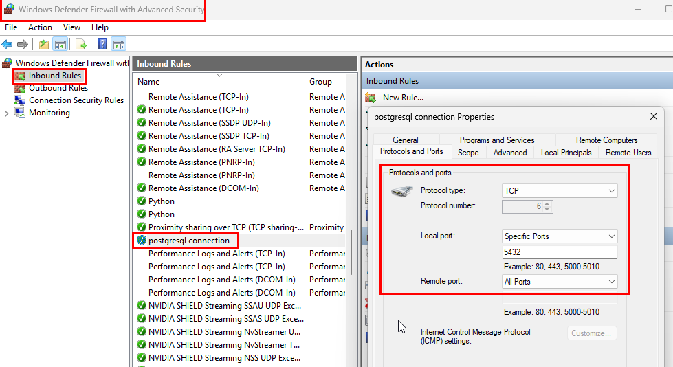

# Setting up a vector data store

**Done**.

After much research I decided that I do not need a vector database such as Pinecone or Supabase. This decision is based on the fact that I'll probably never index more than 50,000 pages. My chunk token count should stay under 4 million tokens. Therefore, I'm going with open source postgresql and pgvector. 

## Strategy

It's worth noting that we only need a single database because disparate content will be identified by metadata. For example, a FrameMaker query doesn't need to know anything about Markdown or PDF tools. Both custom and generated metadata should adequately isolate content by domain. In addition to script-extracted or generated metadata, I will be adding custom metadata that includes the domain, content type, and a short description. For example: " FrameScript Specification (for manipulating FrameMaker documents)." The strategy supports:

- **Semantic Isolation**: Vector similarity search should have a high level of retrieval quality since similar embeddings are semantically meaningful in the same context.
- **Query Precision**: Reduced noise to increase performance and relevance for agents working in a specific domain.
- **Efficient Resource Use**: Small, domain-specific collections are faster to query and easier to manage. Isolated contexts provide a way to modify the architecture as the pipeline evolves.
- **Agent-Specific Retrieval**: Specific domains provide a way to use domain-specialized agents and create multi-agent workflows. This keeps the mental model and toolchain cleaner.

LlamaIndex makes this easy:

- Use multiple VectorStoreIndex instances, each pointed to its own domain data and vector store.
- Query the correct index depending on the agent context.
- Use a single PostgreSQL database.
- Create a single table for vectors, but include a domain column ('framemaker', 'markdown', etc.).
- Configure LlamaIndex to use pgvector with filtering by domain at query time.

## Schema

Everything that provides semantic context to the embedding model is stored with the chunk. Other items are stored in the metadata and stored separately. It's important to preserve the hierarchical and logical placement of the chunk relative to the document.

| Schema Item        | Source        | Text type   | Data Type   | Definitions                                                                                   |
|--------------------|---------------|-------------|------------|-----------------------------------------------------------------------------------------------|
| custom title       | user supplied | metadata    | TEXT       | metadata.yaml Source may not have it and/or doc cleanup may remove it                         |
| source url         | user supplied | metadata    | TEXT       | metadata.yaml Source may not have it and/or doc cleanup may remove it                         |
| date               | user supplied | metadata    | TEXT       | metadata.yaml Source may not have it and/or doc cleanup may remove it                         |
| domain             | user supplied | metadata    | TEXT       | metadata.yaml Required for separating content in dB using pseudo dB instances                 |
| filename           | file system   | metadata    | TEXT       | Read from system                                                                              |
| id                 | generated     | metadata    | TEXT       | Unique UUID for each chunk                                                                    |
| parent_id          | generated     | metadata    | TEXT       | ID of the parent chunk (if any)                                                               |
| header_level       | generated     | metadata    | INTEGER    | Inferred from heading. May use this with ranking and structuring                              |
| id_prev            | generated     | metadata    | TEXT       | Link to prev                                                                                  |
| id_next            | generated     | metadata    | TEXT       | Link to next                                                                                  |
| examples           | generated     | metadata    | TEXT       | List of code example references                                                               |
| ranking            | generated     | metadata    | REAL       | Pre ranking based on # of matches in parents, children, summary, etc.                         |
| token count        | generated     | metadata    | INTEGER    | Only used if we're interested in checking relative chunk sizes                                |
| type               | generated     | metadata    | TEXT       | Code example only: null if text, "code_example" if code                                       |
| language           | generated     | metadata    | TEXT       | Code example only: The auto-detected language of the code example                             |
| embedding          | generated     | vector      | vector     | Optional: store the embedding (1536) vector separately                                        |
| heading            | document      | chunk       | TEXT       | Closest header (h1-h4)                                                                        |
| concat header path | generated     | chunk       | TEXT       | Header hierarchy path (e.g., "Getting Started > Installation")                                |
| content/text       | document      | chunk       | TEXT       | The chunked text                                                                              |
| summary            | generated     | chunk       | TEXT       | Auto-generated summary of this chunk alone                                                    |
| context_summary    | generated     | chunk       | TEXT       | Generated summary of the parent section for added semantic context                            |


## Example data 

**Note**: The actual schema is better and continues to evolve.

```json
{
  "id": "chunk-0458",
  "embedding": [0.123, -0.456, 0.789, ...],  // 1536 floats for `text-embedding-3-small`
  "text": "To install the CLI, run `npm install -g example-cli`...",
  "metadata": {
    "section_header": "Installation",
    "full_path": "Docs > Getting Started > Installation",
    "summary": "Explains how to install the CLI via npm.",
    "context_summary": "Covers the setup and configuration for first-time users.",
    "parent_node": "chunk-0457",
    "child_nodes": ["chunk-0459", "chunk-0460"],
    "doc_id": "doc-101",
    "title": "Getting Started Guide",
    "custom_title": "Beginner Setup",
    "source_url": "https://example.com/docs/getting-started",
    "file_name": "getting-started.md",
    "date": "2024-06-01",
    "code_example_ref": "example-CLI-install-1",  // could link to a repo or blob store
    "tokens": 138,
    "chunk_index": 3
  }
}
```

## Vector database setup 

### Install llamaiindex packages

1. pip install llama-index-vector-stores-postgres
2. pip install psycopg2-binary: a Python package that provides a PostgreSQL database adapter for Python. It allows your Python code to connect to and interact with a PostgreSQL database. It is commonly used in Python projects that need to run SQL queries, manage tables, or interact with PostgreSQL in any way.
3. pip install openai: The openai Python package is the official client library for accessing OpenAI's APIs (such as GPT-3, GPT-4, embeddings, etc.) from Python code. It allows you to send requests to OpenAI models (for text generation, embeddings, etc.) and receive responses in your Python programs.

### Set up postgreSQL and pgvector

1. Install https://www.enterprisedB.com/downloads/postgres-postgresql-downloads
2. pip install pgvector (to verify the package) installed (does not install pgvector extension)
3. Compile/build pgvector: ⌛This step was filled with landmines and pitfalls. There are many install paths, including Docker, VMs, Windows build tools, etc. I didn't want to install 7 GB of Visual Studio files, and my AI agent told me I could use MSYS. However, that rabbit hole cost me several hours. In the end, I installed Visual Studio and followed the instructions [in this article](https://www.mindfiretechnology.com/blog/archive/installing-pgvector-in-preparation-for-retrieval-augmented-generation/), and was up and running in 30 minutes.
4. pwd: xxxx; port 5432
5. Get pgadmin: https://www.postgresql.org/ftp/pgadmin/pgadmin4/v9.4/windows/
6. Verify postgresql server is running (services.msc)
7. Open pgadmin
8. Create a new server
9. Connect to the server
10. Open the query workspace tool
11. Choose the server to query.
12. ????


## Packages used

```python
import json
import logging
import sys
from pathlib import Path
import psycopg2
```

from psycopg2.extras import execute_batch
import os

## Push to database

1. Launch pgAdmin (auto starts the server)
2. Create a server.
3. Right click on the server.
4. Choose **Register > Server**.
5. Provide a name, host name, port, username
6. Adobe gotcha: Enable the port via Windows Defender Firewall if needed (image below).
7. Select the Server.
8. Select the Query tool.
9. Create the dB.
10. Connecting to the dB took several hours of troubleshooting. Hopefully you're not a novice.
11. Run vectory.py
12. Verify the chunks exist. To view your data in pgAdmin: In the Browser panel, expand **Databases > postgres > Schemas > public > Tables**. Select **Select View/Edit Data > All Rows**.

**Windows firewall port configuration**
